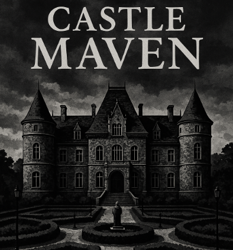

# Castle Maven



*A tiny, scene-based gothic castle crawl built to showcase **HTML + CSS**, with just enough JavaScript for puzzles, endings, and ambient effects.*

**Play:** [https://scalemailted.github.io/CastleMaven/](https://scalemailted.github.io/CastleMaven/)

**Code:** [https://github.com/scalemailted/CastleMaven](https://github.com/scalemailted/CastleMaven)

---

## What is it?

**Castle Maven** is a minimalist interactive-story game. Each “room” is a plain HTML page with an image map, hover or click hotspots to explore, solve a small puzzle in the library, avoid a few nasty ends, and (maybe!) unlock the treasure vault. No backend, no build step, just static files. &#x20;

---

## Design philosophy

* **Minimal JavaScript:** tiny, local scripts for the library puzzle and the vault passphrase. &#x20;
* **Framework-free:** no React/bundlers—everything is “view-source” friendly.
* **HTML/CSS-first UI:** navigation via `<map>/<area>` hotspots with `title` tooltips. &#x20;
* **Teaching-friendly:** demonstrates image maps, basic DOM events, audio, and multi-page flows.&#x20;

---

## Quick start

1. Open the **Play** link and tap **Start**.&#x20;
2. In the **Grand Hall**, hover/click doorways to visit rooms.&#x20;
3. **Tip:** The **Library** hides a button-panel puzzle; the **Vault** demands a passphrase. &#x20;
4. Beware shortcuts: the **Cellar** and **Bedchamber** are… unwise. &#x20;

---

## How to play

* **Hover or click hotspots** on each scene image; the cursor and tooltip hint what you’ll find.&#x20;
* **Garden & Kitchen:** lateral exploration; the kitchen even has ambient audio. &#x20;
* **Library puzzle:** press the correct stone combination to reveal the **Vault** entrance. (It uses simple checkbox logic.)&#x20;
* **Vault ending:** enter the correct passphrase to win; otherwise… dust. (Change the expected string directly in `vault.html`.)&#x20;

---

## How it works (under the hood)

* **Scenes as pages:** each room is a standalone HTML document under `/game`, linked by image-map hotspots.&#x20;
* **Tooltips:** `<area title="...">` provides flavor text without extra JS.&#x20;
* **Micro-scripts:** the **Library** uses checkboxes + a handler to gate the **Vault**; the **Vault** checks an input string and toggles win/lose panels. &#x20;
* **Media:** the **Kitchen** demonstrates `<audio controls>` for ambience.&#x20;

---

## File map (scenes)

* `index.html` – Introduction & **Start** button.&#x20;
* `hall.html` – **Grand Hall** hub with mapped exits to rooms.&#x20;
* `kitchen.html` – **Rancid Kitchen** (ambience, cellar access).&#x20;
* `cellar.html` – **Cellar** (fatal fall → Game Over).&#x20;
* `garden.html` – **Alluring Garden** (explorable beds, return path).&#x20;
* `bedroom.html` – **Master’s Bedroom** hub (to bed or writing desk).&#x20;
* `bed.html` – **Royal Death Bed** (Game Over).&#x20;
* `desk.html` – **Writing Desk** (note discovery, back to bedroom).&#x20;
* `study.html` – **Ancient Library** with the 3×3 stone-button puzzle.&#x20;
* `vault.html` – **Gleaming Vault** (passphrase → Win/Lose + Replay).&#x20;

**Repo layout**

```
docs/            # screenshots, promo image (e.g., docs/castle_maven.png)
game/            # all scene HTML, assets/, styles/, scripts/
index.html       # redirect or landing page to /game/index.html (optional)
readme.md
```

---

